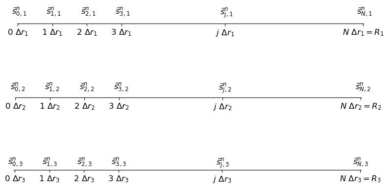

Implementation
===================================================

The Numerical Discretization
-----------------------------

Consider the following discretization, 
with :math:`N_x` intervals, thus having :math:`\Delta r_i = \frac{R_i}{N_x}` 
and timestep :math:`\Delta t`. 

Let's define the approximations: 

.. math::
   \tilde{s}_{b}^{n} &= S_b(n \Delta t) \\
   \tilde{s}_{j,i}^{n} &= S(n \Delta t, j \Delta r_i, R_i)

Consider the figure:

For each timestep :math:`\Delta t`, we have :math:`N_x+1` unknowns in each particle size, and one 
unknown in the bulk phase, so the total number of unknown are :math:`(N_x+1) N_R + 1`.

The time partial derivative can be discretized as:

.. math::
   \frac{\partial S}{\partial t} (n \Delta t, j \Delta r_i, R_i) 
   \approx 
   \frac{\tilde{s}^{n+1}_{j,i} - \tilde{s}^{n}_{j,i}}{\Delta t} 

The central implicit discretization for the first and second partial space derivatives are:

.. math:: 
   \frac{\partial S}{\partial r}(n\Delta t, j \Delta r_i, R_i) 
   & \approx 
   \frac{1}{2} \frac{\tilde{s}^{n+1}_{j+1,i}-\tilde{s}^{n+1}_{j-1,i}}{2 \Delta r_i} 
   + \frac{1}{2} \frac{\tilde{s}^{n}_{j+1,i}-\tilde{s}^{n}_{j-1,i}}{2 \Delta r_i} \\
   \frac{\partial^2 S}{\partial r^2}(n\Delta t, j \Delta r_i, R_i) 
   & \approx 
   \frac{1}{2} \frac{\tilde{s}^{n+1}_{j+1,i} -2 \ \tilde{s}^{n+1}_{j,i} + \tilde{s}^{n+1}_{j-1,i}}{(\Delta r_i)^2} 
   +
   \frac{1}{2}\frac{\tilde{s}^{n}_{j+1,i} -2 \ \tilde{s}^{n}_{j,i} + \tilde{s}^{n}_{j-1,i}}{(\Delta r_i)^2} 

The one-sided discretization for the first space derivatives are:

.. math:: 
   \frac{\partial S}{\partial r}(n \Delta t,0, R_i) 
   & \approx \frac{ - 3 \ \tilde{s}^{n}_{0,i} + 4 \ \tilde{s}^n_{1,i} - \tilde{s}^{n}_{2,i}}{2 \Delta r}  \\
   \frac{\partial S}{\partial r}(n \Delta t,N_x \Delta r_i, R_i) 
   & \approx \frac{ \tilde{s}^{n}_{N_x-2,i} - 4 \ \tilde{s}^n_{N_x-1,i} + 3\tilde{s}^{n}_{N_x,i}}{2 \Delta r} 

The reaction-diffusion equation is: 

.. math::
   \tilde{s}^{n+1}_{j} - \frac{\Delta t D_S}{2 (\Delta r)^2} \left[ \left( 1-\frac{2}{j} \right) \tilde{s}^{n+1}_{j-1} -2 \ \tilde{s}^{n+1}_{j} + \left(1+\frac{2}{j} \right)\tilde{s}^{n+1}_{j+1} \right]  \\
   = \\
   \tilde{s}^{n}_{j} + \frac{\Delta t D_S}{2 (\Delta r)^2} \left[ \left(1-\frac{2}{j}\right)\tilde{s}^{n}_{j-1} -2 \ \tilde{s}^{n}_{j} + \left( 1+\frac{2}{j} \right) \tilde{s}^{n}_{j+1} \right] \\
   - \Delta t \ v_e (\tilde{s}^{n+1}_{j,i}) \ I(n \Delta t) \ Z( j \Delta r_i, R_i) 

The boundary condition at :math:`r=0` gets discretized as 

.. math:: 
   -3 \tilde{s}^{n+1}_0 + 2 \tilde{s}^{n+1}_1 + \tilde{s}^{n+1}_2 = 0

The continuity conditions at :math:`r=R_i` are:

.. math:: 
   \tilde{s}^{n}_{b} & = \tilde{s}^{n}_{N_x, i} \textrm{ for } i \in \{ 1, 2, \cdots, N_R \} \\
   \tilde{s}^{n+1}_{b} + \sum_{i=1}^{N_c} \gamma_i (\tilde{s}^{n+1}_{N_x-2, i} + 2 \ \tilde{s}^{n+1}_{N_x-1, i} - 3 \ \tilde{s}^{n+1}_{N_x, i})
   &= \tilde{s}^{n}_{b} - \sum_{i=1}^{N_c} \gamma_i (\tilde{s}^{n}_{N_x-2, i} + 2 \ \tilde{s}^{n}_{N_x-1, i} - 3 \ \tilde{s}^{n}_{N_x, i})

where :math:`\gamma_i=\frac{3 D_s V_c}{V_R E[R^3]} N_x^2 \Delta r_i`   

The initial condition at the surface of the particles are 

.. math:: 
   \tilde{s}_b(0) &= S_0 \\
   \tilde{s}_{j,i}^{0} &= 0 \textrm{ for } 0 \leq j < N_x

The Numerical Implementation
-----------------------------

We stack the vectors and explicitely replace :math:`\tilde{s}^{n}_{b} = \tilde{s}^{n}_{N_x, i}`,
so the vector has size :math:`Nx N_R +1`. We will use the notation :math:`s^{n}_{j + i N_x} = \tilde{s}^{n}_{j,i}` 
and :math:`s^{n}_{N_x N_R + 1} = s^{n}_{b}`.

For each time step, we must solve:

.. math:: (I + A) \vec{s}^{n+1} = (I - A) \vec{s}^{n}  + \Delta t \vec{v}^n

As the matrices are fixed (do not depend on the time variable), they can be computed and stored. 
A PLU factorization (Permutation Lower Upper) is computed for efficiently solve the equation in each time step.

The vectors and matrices are defined as:

.. math::
   \vec{s}^{n} = 
   \left( \begin{array}{c}
   s^{n}_{0} \\
   s^{n}_{1} \\
   s^{n}_{2} \\
   \vdots \\
   s^{n}_{N_x-3} \\
   s^{n}_{N_x-2} \\
   s^{n}_{N_x-1} \\ \hline
   \vdots \\ \hline
   s^{n}_{(N_c-1) N_x} \\
   s^{n}_{(N_c-1) N_x + 1} \\
   s^{n}_{(N_c-1) N_x + 2} \\
   \vdots \\
   s^{n}_{(N_c-1) N_x + N_x-3} \\
   s^{n}_{(N_c-1) N_x + N_x-2} \\
   s^{n}_{(N_c-1) N_x + N_x-1} \\ \hline
   s^{n}_{N_R N_x+1}
   \end{array} \right)
   = 
   \left( \begin{array}{c}
   s^{n}_{0,1} \\
   s^{n}_{1,1} \\
   s^{n}_{2,1} \\
   \vdots \\
   s^{n}_{N_x-3,1} \\
   s^{n}_{N_x-2,1} \\
   s^{n}_{N_x-1,1} \\ \hline
   \vdots \\ \hline
   s^{n}_{0,N_c} \\
   s^{n}_{1,N_c} \\
   s^{n}_{2,N_c} \\
   \vdots \\
   s^{n}_{N_x-3,N_c} \\
   s^{n}_{N_x-2,N_c} \\
   s^{n}_{N_x-1,N_c} \\ \hline
   s^{n}_{b}
   \end{array} \right)

.. math::
   I = \left[ \begin{array}{ccccccc|c|ccccccc|c}
   0 &  &  &  &  &  &  & \cdots &  &  &  &  &  &  &  & \\
   & 1 &  &  &  &  &  & \cdots &  &  &  &  &  &  &  & \\
   &  & 1 &  &  &  &  & \cdots &  &  &  &  &  &  &  & \\
   &  &  & \ddots &  &  &  & \cdots &  &  &  &  &  &  &  & \\
   &  &  &  & 1 &  &  & \cdots &  &  &  &  &  &  &  & \\
   &  &  &  &  & 1 &  & \cdots &  &  &  &  &  &  &  & \\
   &  &  &  &  &  & 1 & \cdots &  &  &  &  &  &  &  & \\ \hline
   \vdots & \vdots & \vdots & \vdots & \vdots & \vdots & \vdots & \ddots & \vdots & \vdots & \vdots & \vdots & \vdots & \vdots & \vdots & \\\hline
   &  &  &  &  &  &  & \cdots & 0 &  &  &  &  &  &  & \\
   &  &  &  &  &  &  & \cdots &  & 1 &  &  &  &  &  & \\
   &  &  &  &  &  &  & \cdots &  &  & 1 &  &  &  &  & \\
   &  &  &  &  &  &  & \cdots &  &  &  & \ddots &  &  &  & \\
   &  &  &  &  &  &  & \cdots &  &  &  &  & 1 &  &  & \\
   &  &  &  &  &  &  & \cdots &  &  &  &  &  & 1 &  & \\
   &  &  &  &  &  &  & \ddots &  &  &  &  &  &  & 1 & \\ \hline
   &  &  &  &  &  &  & \ddots &  &  &  &  &  &  &  & 1 \\
   \end{array} \right]

.. math::
   A = \left[ \begin{array}{ccccccc|c|ccccccc|c}
   -3 &  2  & 1 &  &  &  &  & \cdots &  &  &  &  &  &  &  & \\
   a_{2,1} & b_{2,1} & c_{2,1} &  &  &  &  & \cdots &  &  &  &  &  &  &  & \\
   & a_{3,1} & b_{3,1} & c_{3,1} &  &  &  & \cdots &  &  &  &  &  &  &  & \\
   &  &  & \ddots &  &  &  & \cdots &  &  &  &  &  &  &  & \\
   &  &  & a_{N_x-3,1} & b_{N_x-3,1} & c_{N_x-3,1} &  & \cdots &  &  &  &  &  &  &  & \\
   &  &  &  & a_{N_x-2,1} & b_{N_x-2,1} & c_{N_x-2,1} & \cdots &  &  &  &  &  &  &  & \\
   &  &  &  &  & a_{N_x-1,1} & b_{N_x-1,1}  & \cdots &  &  &  &  &  &  &  & c_{N_x-1,1} \\ \hline
   \vdots & \vdots & \vdots & \vdots & \vdots & \vdots & \vdots & \ddots & \vdots & \vdots & \vdots & \vdots & \vdots & \vdots & \vdots & \\\hline
   &  &  &  &  &  &  & \cdots & -3 & 2 & 1 &  &  &  &  & \\
   &  &  &  &  &  &  & \cdots & a_{2,N_R} & b_{2,N_R} & c_{2,N_R} &  &  &  &  & \\
   &  &  &  &  &  &  & \cdots &  & a_{3,N_R} & b_{3,N_R} & c_{3,N_R} &  &  &  & \\
   &  &  &  &  &  &  & \cdots &  &  &  & \ddots &  &  &  & \\
   &  &  &  &  &  &  & \cdots &  &  &  & a_{N_x-3,N_R} & b_{N_x-3,N_R} & c_{N_x-3,N_R} &  & \\
   &  &  &  &  &  &  & \cdots &  &  &  &  & a_{N_x-2,N_R} & b_{N_x-2,N_R} & c_{N_x-2,N_R} & \\
   &  &  &  &  &  &  & \cdots &  &  &  &  &  & a_{N_x-1,N_R} & b_{N_x-1,N_R} & c_{N_x-1,N_R}\\ \hline
   &  &  &  &  & -\gamma_1 & -2 \gamma_1 & \cdots &  &  &  &  &  & -\gamma_1 & -2 \gamma_{N_R} & 3 \sum_{i=1}^{N_R} \gamma_i \\
   \end{array} \right]

.. math::
   \vec{v}^{n} = 
   \left( \begin{array}{c}
   0 \\
   V(s^{n}_{1,1}) \ I(n \Delta t) \ Z(1 \Delta r_1, R_1)\\
   V(s^{n}_{2,1}) \ I(n \Delta t) \ Z(2 \Delta r_1, R_1)\\
   \vdots \\
   V(s^{n}_{N_x-3,1}) \ I(n \Delta t) \ Z( (N-x-3) \Delta r_1, R_1)\\
   V(s^{n}_{N_x-2,1}) \ I(n \Delta t) \ Z( (N-x-2) \Delta r_1, R_1)\\
   V(s^{n}_{N_x-1,1}) \ I(n \Delta t) \ Z( (N-x-1) \Delta r_1, R_1)\\ \hline
   \vdots \\ \hline
   0 \\
   V(s^{n}_{1,N_c}) \ I(n \Delta t) \ Z(1 \Delta r_{N_c}, R_{N_c})\\
   V(s^{n}_{2,N_c}) \ I(n \Delta t) \ Z(2 \Delta r_{N_c}, R_{N_c})\\
   \vdots \\
   V(s^{n}_{N_x-3,N_c} \ I(n \Delta t) \ Z( (N_x-3) \Delta r_{N_c}, R_{N_c})\\
   V(s^{n}_{N_x-2,N_c} \ I(n \Delta t) \ Z( (N_x-2) \Delta r_{N_c}, R_{N_c})\\
   V(s^{n}_{N_x-1,N_c} \ I(n \Delta t) \ Z( (N_x-1) \Delta r_{N_c}, R_{N_c})\\ \hline
   0
   \end{array} \right)

